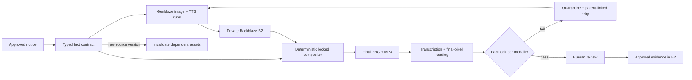

# RecallCast

**Fact-locked generative media for product recalls.**

RecallCast turns an approved safety notice into an English and Spanish media
package, reverse-extracts the claims in every asset, and blocks release when a
critical fact is missing, mutated, contradicted, or weakened.

The core product is **FactLock**, a safety compiler:

```text
approved notice → typed fact contract → generated media → reverse extraction
                → deterministic per-modality checks → human release gate
```

## Architecture



The intended script and overlay manifest are stored separately from the
observed transcript and OCR. Both sides must conform to the same contract;
the intended text can never substitute for evidence extracted from the final
media.

This repository currently contains the first end-to-end hackathon slice:

- A polished judge-facing RecallCast workspace
- A typed fictional recall and fact contract
- Deterministic checks for identifiers, lot bounds, safety action, remedy,
  phone number, URL, and effective date
- Controlled `NG-110 → NG-101` and action-weakening failures
- Fail-closed quarantine decisions with extracted evidence
- Retry lineage and a passing corrected attempt
- Human approval and source-update invalidation in the UI
- Live OpenAI image and narration generation through Genblaze into private B2
- Reverse transcription and visual reading against separate channel policies
- A verified English image/audio evidence package with 15 passing checks
- A bounded, parent-linked corrective narration retry that preserves its rejected parent
- Review-first `.txt`, `.md`, and `.json` intake with OpenAI Structured Outputs,
  deterministic source-grounding checks, and separate B2 draft/confirmation objects
- A first safe Policy Pack Builder for English stop-use recalls: reviewer-selected
  source-grounded concepts, exact model/range rules, contract/policy hash binding,
  B2 persistence, custom voice + visual generation, FactLock, and human approve/reject
- A separately labeled public-source workspace for CPSC recall 26-333 with
  23 exact models, one serial range, regulator attribution, explicit operator
  acknowledgment, and a runnable fail-closed voice + visual draft
- One-click Judge Mode that exposes the rejected narration beside its verified
  parent-linked correction, with both playable B2-backed audio attempts
- A two-asset public media kit: action-first consumer alert plus the exact-model
  eligibility companion required by the public-case policy
- Python tests that do not require credentials

## Run locally

### API

Python 3.11+ is required.

```bash
cd services/api
uv sync --extra dev --extra genblaze
set -a
source ../../.env
set +a
uv run uvicorn app.main:app --reload --port 8000
```

The API is available at `http://localhost:8000`; interactive docs are at
`http://localhost:8000/docs`.

Run tests:

```bash
cd services/api
uv run pytest
```

### Web app

Node 20+ is required.

```bash
cd apps/web
npm install
npm run dev
```

Open `http://localhost:3000`. The UI can demonstrate the complete controlled
failure, retry, approval, and stale-asset story without provider credentials.
When the API is available, set `NEXT_PUBLIC_API_URL=http://localhost:8000`.

Run the production containers locally with `docker compose up --build`. The
provider-spend endpoints are serialized, idempotent by default, and require
`X-RecallCast-Admin-Token` when forced regeneration is requested.

## API slice

| Method | Path | Purpose |
|---|---|---|
| `GET` | `/health` | Health and runtime mode |
| `GET` | `/api/demo` | Fictional recall, fact contract, and scenarios |
| `POST` | `/api/validate` | Validate reverse-extracted media text |
| `POST` | `/api/demo/run` | Run a controlled asset through FactLock |
| `POST` | `/api/demo/retry/{run_id}` | Create a parent-linked corrected retry |
| `POST` | `/api/assets/{asset_id}/approve` | Apply the human release gate |
| `POST` | `/api/demo/source-update` | Change the contract and stale prior assets |
| `GET` | `/api/storage/health` | Verify live B2 connection and encryption |
| `POST` | `/api/storage/bootstrap` | Persist source notice and fact contract |
| `GET` | `/api/storage/objects` | Inspect the RecallCast B2 evidence graph |
| `GET` | `/api/storage/presign` | Create a short-lived private asset URL |
| `POST` | `/api/intake/extract` | Extract a typed, review-only contract draft from uploaded/pasted text |
| `POST` | `/api/intake/confirm` | Revalidate edits and persist a human-confirmed contract separately |
| `GET` | `/api/intake/{draft_id}/policy` | Load the contract-bound policy draft or active policy |
| `POST` | `/api/intake/{draft_id}/policy/activate` | Attest, validate, hash-bind, and persist deterministic rules |
| `POST` | `/api/intake/{draft_id}/packages/generate` | Generate and independently validate a policy-enabled custom package |
| `POST` | `/api/intake/{draft_id}/packages/{package_id}/review` | Persist the custom package's terminal human decision |
| `GET` | `/api/cases/cpsc-26-333` | Return the attributed public CPSC case and unconfirmed fact contract |
| `POST` | `/api/cases/cpsc-26-333/bootstrap` | Persist source, contract, and attribution evidence in B2 |
| `POST` | `/api/cases/cpsc-26-333/confirm` | Record operator source acknowledgment and enable draft generation |
| `POST` | `/api/cases/cpsc-26-333/packages/generate` | Build or return the public-case voice + visual evidence package |
| `POST` | `/api/cases/cpsc-26-333/packages/{package_id}/review` | Persist a terminal human approve/reject decision bound to package evidence |
| `POST` | `/api/genblaze/sdk-storage-smoke` | Verify Genblaze manifests and B2 sink |
| `POST` | `/api/genblaze/live-background` | Generate an OpenAI background through Genblaze into B2 |
| `POST` | `/api/packages/generate` | Return or build the live multimodal evidence package |
| `POST` | `/api/packages/revalidate` | Re-run FactLock over stored transcript and OCR evidence |

## Safety model

- Critical identifiers use exact or normalized deterministic matching.
- A failed blocking check cannot be averaged away by a model score.
- Missing reverse-extraction evidence produces `quarantined`, never `passed`.
- Generated backgrounds remain creative; product identity and critical safety
  overlays are deterministic.
- AI drafts and checks. A human releases.
- Public-case approval and rejection are terminal, append-only review records
  binding reviewer, rationale, contract hash, validation hash, and artifact hashes.
- Imported sources never trigger media generation automatically. The first custom
  template supports English stop-use recalls with 1–4 models, 1–3 ranges, a phone,
  and a URL; unsupported contracts fail closed before provider spend.
- Custom media is bound to both the confirmed contract hash and active policy hash.

All demo data is fictional. RecallCast is not legal advice, regulatory
approval, certified translation, or a substitute for qualified human review.

## Provider path

The provider adapter in
`services/api/app/providers/genblaze_pipeline.py` follows the official
Genblaze `Pipeline`, `ObjectStorageSink`, optional image fallback models,
manifest verification, and parent-run concepts. The verified path uses OpenAI
while critical recall facts remain deterministic compositor layers.

| Stage | Implementation | Failure behavior |
|---|---|---|
| Creative background | Genblaze + OpenAI `gpt-image-2` | reuse verified B2 background |
| Narration | Genblaze + OpenAI `gpt-4o-mini-tts` | one contract-derived parent-linked retry |
| Reverse transcription | OpenAI `gpt-transcribe` | quarantine when absent or nonconforming |
| Visual reading | OpenAI `gpt-5.6-sol` vision | quarantine when absent or nonconforming |
| Composition | deterministic Pillow template | critical copy never delegated to image generation |
| Release | deterministic FactLock + human review | never auto-release |

### Verified SDK versions

| Package | Version | Status |
|---|---:|---|
| `genblaze-core` | `0.3.8` | Pipeline and manifest verified |
| `genblaze-s3` | `0.3.6` | Live B2 sink verified |
| `genblaze-openai` | `0.3.4` | `gpt-image-2` live path configured |

### Verified live OpenAI run

On August 1, 2026, the project generated one `gpt-image-2` background through
Genblaze, stored the PNG and manifest in private B2, and verified the manifest.
Run `59d1f1b6-f355-4638-93a3-7c13f51881a5` completed its provider step in
20.5 seconds. The asset SHA-256 is
`aca9d67aa1d96e2001e958afe4c75349171b84f6a19ad28bccd323bdb280e869` and
the manifest hash is
`ac16d4bb67e365900596412f9c921bddc448a49665765679134629367dc4a52c`.

The `sdk-storage-smoke` endpoint deliberately uses Genblaze's explicit mock
provider with a deterministic fixture. It proves the SDK, B2 sink, asset
transfer, SHA-256 manifest, and verification path, but is never represented as
AI-generated media.

The live OpenAI endpoint is implemented with a creative-background-only prompt.
All critical product identifiers and safety text remain outside the generated
layer.

### Verified multimodal package

On August 1, 2026, package `pkg_fe230c3fab0424ca` reused the verified
`gpt-image-2` background, composed the final 1080×1080 card, generated a real
`gpt-4o-mini-tts` MP3 through Genblaze, reverse-transcribed it with
`gpt-transcribe`, and independently read the final pixels with `gpt-5.6-sol`.
FactLock passed all 15 audio and visual checks and left the package in
`needs_review`; the narration manifest hash is
`93c68f02c6c01eb66714828ffdd06d9d70667f4cd8398090d4b0dd3deeabffa0`.

Spanish package `pkg_495ddb0b8a5419cc` independently passed the same 15
checks. The Unicode-safe compositor was verified from the final pixels,
including accented safety text and the human-approval watermark.

A separate fail-closed live run preserved rejected narration run
`9b9540fe-bc9f-49a9-9c45-c118b5797b0e` and generated corrective run
`56b977e5-f975-4112-953c-367fb2a010ce`. The child manifest points to the
rejected run as its parent and the corrected evidence passed all 15 checks.

### Verified public-source case package

The separately labeled CPSC 26-333 workspace is now runnable after an operator
checks the official notice and records an acknowledgment. Package
`pkg_1c77641198bc83f8` generated a deterministic 1080×1080 card containing all
23 exact models and produced an AI narration through Genblaze. The first voice
run mutated the upper serial endpoint during speech and was correctly rejected.
Corrective run `22655855-0461-443a-ac08-45ac378d976c` is linked to rejected run
`503ac6b5-88be-4c6d-b38e-4b5ae07c9ba9`, deliberately enunciates each serial
character, and passed the 14 public-case audio and visual checks with zero
blocking failures. The package remains `needs_review`; it is an unaffiliated
AI draft, never an official CPSC or Electrolux Group communication.
After FactLock passes, the package remains `needs_review` until a named reviewer
records a rationale and either rejects it or accepts an explicit accountability
attestation. That decision is stored as immutable review evidence in B2 and the
current package head is updated to `approved` or `rejected`.

The package UI deliberately separates communication from proof. The consumer
alert leads with the required action and refers viewers to the companion card;
the companion retains all 23 exact model identifiers. Judge Mode then shows the
failed and corrected transcripts, audio, run IDs, parent link, checks, and human
release gate without requiring judges to explore the full workspace first.

## Environment

Copy `.env.example` and add only the credentials needed by the path being run.
Never expose provider or storage credentials to the browser.

Backblaze bucket setup, least-privilege key guidance, lifecycle rules, CORS,
and verification are in [infra/b2](infra/b2/README.md).

## Challenge fit

RecallCast is designed around the four equally weighted judging criteria:

1. **Real-world utility:** safety and recall teams need fast, accessible media
   without weakening approved instructions.
2. **Production readiness:** explicit state, fail-closed validation, bounded
   retry, fallback, human approval, lineage, and version invalidation.
3. **B2 orchestration:** source versions, assets, rejected attempts,
   transcripts, validation reports, and manifests form one durable graph.
4. **Genblaze:** real image and audio generation, B2 asset transfer, verified
   manifests, structured run events, and parent-linked corrective retries.

See [docs/PRODUCT_STRATEGY.md](docs/PRODUCT_STRATEGY.md) for the differentiation
and judging strategy. See [docs/SUBMISSION_CHECKLIST.md](docs/SUBMISSION_CHECKLIST.md)
for the remaining launch work and [docs/DEMO_SCRIPT.md](docs/DEMO_SCRIPT.md)
for the three-minute judging narrative.
