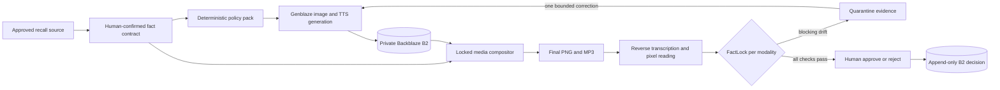
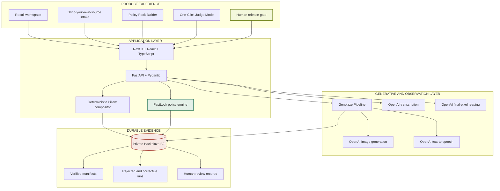

# RecallCast — Fact-Locked Generative Media for Product Recalls

[](https://www.python.org/)
[](https://www.typescriptlang.org/)
[](https://www.backblaze.com/cloud-storage)
[](https://github.com/backblaze-labs/genblaze)
[](https://platform.openai.com/docs/)
[](https://recallcast-app-ankitlade12.onrender.com)
[](#reproducible-testing)
[](LICENSE)

> **Generative media can be polished and wrong. RecallCast proves every safety-critical fact survived generation before a human may release it.**

RecallCast is a multimodal release-assurance platform for product-recall communications. It converts an approved notice into voice and visual media, independently observes the final MP3 and rendered pixels, blocks factual drift, preserves corrective lineage, and records the accountable human decision in private Backblaze B2 storage.

Its core engine, **FactLock**, treats a recall notice like a safety contract—not a prompt.

```text
approved source → confirmed fact contract → active policy pack → generated media
                → reverse observation → deterministic FactLock → human decision
```

**Hackathon:** Backblaze Generative Media Hackathon — Genblaze on B2<br>
**Live demo:** <https://recallcast-app-ankitlade12.onrender.com><br>
**Repository:** <https://github.com/ankitlade12/recallcast><br>
**Demo posture:** fictional controlled case plus a clearly labeled, unaffiliated public-source CPSC proof

## Quick Highlights

- **Final-Media Verification** — validates reverse-transcribed narration and text read from the final rendered pixels, not merely the intended script
- **Fail-Closed FactLock** — missing, mutated, contradicted, weakened, or unavailable critical evidence quarantines the asset
- **Real Mutation Proof** — caught a missing digit in a generated serial-number narration that otherwise sounded plausible
- **Bounded Corrective Agent** — one contract-derived retry, linked to its rejected parent; no open-ended autonomous loop
- **Policy Pack Builder** — safely moves confirmed custom sources into deterministic validation without letting an LLM invent release rules
- **Human Release Authority** — passing AI checks produce `needs_review`, never automatic approval
- **B2 Evidence Graph** — sources, contracts, policies, media, manifests, observations, failed attempts, and decisions remain durably linked
- **Genblaze-Native Orchestration** — real image and TTS provider runs, B2 storage sink, verified manifests, and parent-child lineage
- **Two-Asset Public Media Kit** — action-first consumer alert paired with an exact-model eligibility companion
- **Judge Mode** — exposes the rejected narration, corrected child, evidence diff, and release gate in one guided view

## The Problem

An approved recall notice is rarely the format consumers ultimately receive. Safety and communications teams must turn it into social cards, audio announcements, localized guidance, and accessible media—often under urgent deadlines.

Generative AI accelerates production, but it introduces a dangerous failure mode: an asset may look and sound credible while changing a model number, dropping a serial digit, weakening “stop using immediately,” inventing a remedy, or altering a contact detail.

Prompt review cannot prove what reached the final file. Semantic similarity cannot safely validate exact identifiers.

**Safety-critical media needs a release gate, not another confidence score.**

## The Solution

RecallCast compiles an approved source into closed-world release invariants:

1. Import or select an approved recall notice.
2. Extract a structured draft with OpenAI Structured Outputs.
3. Require a person to review and confirm every source-grounded fact.
4. Bind the contract to an explicit deterministic policy pack.
5. Generate a creative background and AI narration through Genblaze.
6. Compose critical safety copy with a deterministic renderer.
7. Reverse-transcribe the generated audio.
8. Independently read the final image pixels.
9. Run per-modality FactLock checks.
10. Quarantine drift and allow at most one contract-derived correction.
11. Require a named reviewer to approve or reject the package.
12. Store the complete evidence and lineage graph in private B2.

The intended script and overlay manifest remain separate from the observed transcript and OCR. Intended copy can never substitute for evidence extracted from the final media.

## Verified Proof: One Missing Digit Stopped Release

The public-source demonstration uses the CPSC notice for Frigidaire Gas Ranges, Recall 26-333. RecallCast is not affiliated with CPSC or Electrolux Group, and every generated asset is labeled as an unaffiliated AI draft requiring human review.

The locked contract includes:

- 23 exact model identifiers
- serial range `VF52200000–VF54399999`
- delayed-ignition burn hazard
- immediate stop-use action
- approved repair remedy
- official contact details and recall date

During a real Genblaze narration run, reverse transcription observed a malformed serial endpoint. FactLock rejected the attempt, retained its media and report in B2, rebuilt the fragile narration from the contract, and generated one parent-linked corrective child.

| Evidence | Rejected attempt | Corrective attempt |
|---|---|---|
| Decision | `quarantined` | `needs_review` |
| Upper serial evidence | missing digit | exact character sequence |
| Run | `503ac6b5-88be-4c6d-b38e-4b5ae07c9ba9` | `22655855-0461-443a-ac08-45ac378d976c` |
| Parent link | none | rejected run |
| Final FactLock result | blocked | 14 checks passed, 0 blocking |

Passing validation still did not release the package. It advanced only to the human decision gate.

## Architecture Overview

### Assurance Loop



### System Architecture



The governing rule is enforced in code: **AI may create and observe media, but deterministic policy and accountable human review control release.**

## Product Features

### Fact Contract and Source Intake

- Review-first `.txt`, `.md`, and `.json` import up to 200 KB
- Schema-constrained OpenAI extraction
- Source-grounding checks for every editable value
- Separate source, extraction-draft, and confirmed-contract objects
- Contract SHA-256 used as the dependency boundary
- Explicit rejection of PDFs and images in the safe MVP

### Deterministic Policy Pack Builder

- Exact model identifiers auto-locked from the confirmed contract
- Exact lot and serial range endpoints auto-locked
- Reviewer-selected, source-grounded hazard, action, and remedy concepts
- Stop-use and urgency requirements enforced by the template
- Contract hash and policy hash bound into generated evidence
- Provider generation disabled until reviewer attestation
- Unsupported structures rejected before provider spend

The first custom template intentionally supports English stop-use recalls with 1–4 models, 1–3 ranges, a phone number, and a URL. New recall classes require new explicit templates; RecallCast does not ask a language model to invent safety policy at runtime.

### Multimodal Generation and Observation

- Creative background through Genblaze and OpenAI `gpt-image-2`
- Narration through Genblaze and OpenAI `gpt-4o-mini-tts`
- Reverse transcription with `gpt-transcribe`
- Final-pixel reading with OpenAI vision
- Deterministic, Unicode-safe critical-copy composition with Pillow
- Separate audio and visual evidence requirements
- Short-lived presigned URLs for private browser review

### FactLock Release Assurance

- Exact or normalized identifier matching
- Complete range-endpoint validation
- Hazard concept coverage
- Required-action polarity and weakening checks
- Remedy contradiction checks
- Normalized phone and URL matching
- Effective-date verification
- Manifest, contract, and policy integrity checks
- Missing evidence treated as blocking, never as a low-confidence pass

### Corrective Lineage and Human Authority

- Rejected attempt retained with its transcript and validation report
- At most one content-aware, contract-derived corrective retry
- Corrective Genblaze run linked to its failed parent
- Passing package remains `needs_review`
- Approval requires reviewer identity, rationale, and explicit attestation
- Approval and rejection are terminal decisions
- Review record binds contract, validation report, and artifact hashes

## Backblaze B2 as an Evidence Graph

B2 is not used as a flat media folder. RecallCast organizes source truth, generated artifacts, reverse observations, and decisions into a durable hierarchy:

```text
recallcast/
├── intake/<draft-id>/
│   ├── source/<source-file>
│   ├── extraction-draft.json
│   ├── confirmed-contract.json
│   ├── policy-draft.json
│   └── active-policy.json
├── recalls/<recall-id>/
│   ├── source/v001/
│   │   ├── notice.txt
│   │   └── fact-contract.json
│   └── packages/<contract-hash>/<locale>/
│       ├── social-card.png
│       ├── approved-script.txt
│       ├── observed-transcript.txt
│       ├── observed-ocr.txt
│       ├── validation.json
│       ├── attempts/001/...
│       ├── reviews/...
│       └── package.json
├── quarantine/<recall-id>/<run-id>/...
└── genblaze/runs/<date>/<run-id>/
    ├── assets/<asset>
    └── manifest.json
```

Every application-written object includes SHA-256 metadata. Genblaze assets retain immutable run identities and canonical manifests. Private media reaches the browser only through bounded presigned GET URLs.

Operational B2 configuration is documented in [`infra/b2`](infra/b2/README.md), with implementation details in [`docs/B2_STORAGE.md`](docs/B2_STORAGE.md).

## Genblaze Integration

RecallCast uses Genblaze as a working orchestration dependency, not as a wrapper mentioned only in documentation.

| Genblaze capability | RecallCast usage |
|---|---|
| `Pipeline` | image and narration provider execution |
| `OpenAITTSProvider` | AI narration generation |
| OpenAI image provider | creative background generation |
| `ObjectStorageSink` | direct S3-compatible transfer into B2 |
| canonical manifest | SHA-256 asset and run verification |
| `Pipeline.from_result(...)` | parent-linked corrective narration |
| structured run metadata | provider, model, attempt, latency, and lineage evidence |

Verified SDK versions:

| Package | Version |
|---|---:|
| `genblaze-core` | `0.3.8` |
| `genblaze-s3` | `0.3.6` |
| `genblaze-openai` | `0.3.4` |

See [`docs/GENBLAZE_USAGE.md`](docs/GENBLAZE_USAGE.md) for the live provider and manifest evidence.

## Tech Stack

| Layer | Technology | Purpose |
|---|---|---|
| Interface | Next.js 16, React 19, TypeScript | responsive workspace, Judge Mode, policy authoring, and review |
| API | Python, FastAPI, Pydantic | workflow enforcement and typed contracts |
| Validation | FactLock | deterministic per-modality conformance checks |
| Orchestration | Genblaze | provider runs, manifests, B2 sink, and retry lineage |
| Generation | OpenAI image + TTS | creative background and narration |
| Observation | OpenAI transcription + vision | independently observe final media |
| Composition | Pillow | deterministic critical-text rendering |
| Storage | Backblaze B2, S3-compatible API | private evidence graph and signed delivery |
| Testing | Pytest, Playwright, TypeScript | API, policy, browser, responsive, and build verification |
| Runtime | Docker Compose | reproducible local production topology |

## Judge Quick Start

### Controlled Demo Without Provider Credentials

1. Open the RecallCast workspace.
2. Select **Identifier mutation** or **Action weakening**.
3. Run FactLock and inspect the blocking finding.
4. Compare the canonical fact with the observed evidence.
5. Run the controlled correction and inspect its parent lineage.
6. Update the fictional source remedy and confirm dependent assets become stale.

### Connected Public-Source Proof

1. Select **Frigidaire Gas Ranges — CPSC 26-333**.
2. Review the official source attribution and exact identifier coverage.
3. Acknowledge the source to enable an unaffiliated draft.
4. Select **Run 60-second proof**.
5. Compare the rejected serial mutation with the corrective narration.
6. Inspect both audio controls, run IDs, parent link, final-pixel evidence, and checks.
7. Record the final human approve or reject decision.

### Bring Your Own Recall Source

1. Open **Import source**.
2. Upload or paste a complete English stop-use recall notice.
3. Review and confirm the extracted contract.
4. Inspect the auto-locked identifiers and proposed concepts.
5. Attest and activate the deterministic policy.
6. Generate the media package.
7. Review final pixels, narration, FactLock evidence, and release decision.

Do not submit sensitive, confidential, or unapproved recall information to a public deployment.

## Local Installation

### Requirements

- Python 3.11+
- Node.js 20+
- [`uv`](https://docs.astral.sh/uv/)
- npm
- Docker Desktop only if using the container path

### Clone and Configure

```bash
git clone https://github.com/ankitlade12/recallcast.git
cd recallcast
cp .env.example .env
```

The controlled fictional flow runs without provider credentials. For the connected path, configure private B2 and OpenAI credentials in `.env`; never expose them to the browser or commit them.

### Run with Docker Compose

```bash
docker compose up --build
```

Open:

- Product: <http://localhost:3000>
- API health: <http://localhost:8000/health>
- Interactive API docs: <http://localhost:8000/docs>

### Run in Development Mode

API:

```bash
cd services/api
uv sync --extra dev --extra genblaze
set -a
source ../../.env
set +a
uv run uvicorn app.main:app --reload --port 8000
```

Web application:

```bash
cd apps/web
npm ci
npm run dev
```

Open <http://localhost:3000>.

## Configuration

Copy `.env.example` to `.env`. The committed example contains no credentials.

```bash
# Runtime
APP_STORAGE_MODE=memory              # use b2 for connected durable storage
NEXT_PUBLIC_API_URL=http://localhost:8000
WEB_ORIGINS=http://localhost:3000

# Private Backblaze B2 credentials
B2_KEY_ID=
B2_APP_KEY=
B2_BUCKET=
B2_REGION=
B2_ENDPOINT=

# Server-side OpenAI providers
OPENAI_API_KEY=
OPENAI_EXTRACTION_MODEL=gpt-5.6-sol
OPENAI_IMAGE_MODEL=gpt-image-2
OPENAI_TTS_MODEL=gpt-4o-mini-tts
OPENAI_TTS_VOICE=coral
OPENAI_TRANSCRIPTION_MODEL=gpt-transcribe
OPENAI_VISION_MODEL=gpt-5.6-sol

# Operations
RECALLCAST_BACKGROUND_KEY=
RECALLCAST_ADMIN_TOKEN=
RECALLCAST_FONT_PATH=
```

Use a bucket-restricted B2 application key. Forced regeneration requires `X-RecallCast-Admin-Token`; ordinary generation is idempotent and serialized to avoid accidental duplicate provider spend.

## Reproducible Testing

API and FactLock suite:

```bash
cd services/api
uv run pytest
```

Web type-check:

```bash
cd apps/web
npm run lint
```

Browser workflows:

```bash
cd apps/web
npm run test:e2e
```

Production web build:

```bash
cd apps/web
npm run build
```

Current verified result:

```text
API and FactLock     42 passed
Browser workflows    5 passed
TypeScript            passed
Next.js build         passed
```

Coverage includes source validation, policy activation, contract and policy hash binding, exact identifier mutation, action reversal, unavailable evidence, manifest failure, per-modality requirements, serial speech matching, public-case confirmation, terminal review decisions, mobile layout, Judge Mode, and the custom import-to-generation workflow.

## API Highlights

| Method | Path | Purpose |
|---|---|---|
| `GET` | `/health` | runtime, storage, and provider readiness |
| `POST` | `/api/validate` | run FactLock over reverse-extracted evidence |
| `POST` | `/api/demo/run` | execute a controlled validation case |
| `POST` | `/api/demo/retry/{run_id}` | create a parent-linked corrected attempt |
| `POST` | `/api/intake/extract` | create a review-only contract draft |
| `POST` | `/api/intake/confirm` | confirm and persist a source-grounded contract |
| `POST` | `/api/intake/{draft_id}/policy/activate` | attest and activate deterministic rules |
| `POST` | `/api/intake/{draft_id}/packages/generate` | build a custom evidence package |
| `POST` | `/api/intake/{draft_id}/packages/{package_id}/review` | record terminal human review |
| `POST` | `/api/cases/cpsc-26-333/packages/generate` | build or load the public-case proof |
| `POST` | `/api/genblaze/live-background` | create a bounded live Genblaze image run |
| `GET` | `/api/storage/presign` | issue a short-lived private asset URL |

Interactive OpenAPI documentation is available at `/docs` while the API is running.

## Project Structure

```text
recallcast/
├── apps/web/                    # Next.js product interface and Playwright tests
├── services/api/               # FastAPI, FactLock, media pipeline, and Pytest suite
│   └── app/
│       ├── domain/             # contracts, policies, findings, packages, and reviews
│       ├── media/              # composition, TTS, observation, retry, and packaging
│       ├── providers/          # Genblaze provider orchestration
│       ├── storage/            # private B2 adapter
│       └── validation/         # deterministic FactLock engine
├── infra/b2/                   # CORS, lifecycle, least-privilege, and verification
├── docs/                       # focused B2 and Genblaze technical evidence
├── compose.yaml
├── render.yaml                 # two-service Render Blueprint
├── .env.example
└── LICENSE
```

## Safety and Security Boundaries

- Critical recall copy is rendered deterministically, not generated into pixels by an image model.
- A model score cannot override a blocking deterministic failure.
- Missing transcript or visual evidence quarantines the package.
- Contracts require human confirmation before custom policy activation.
- Policy concepts must be grounded in the confirmed canonical fields.
- Approval requires a passing package, a named reviewer, a rationale, and attestation.
- Review decisions are terminal and bind all artifact hashes.
- Provider credentials remain server-side; `.env` is ignored by Git.
- Private B2 objects are reviewed through time-bounded signed URLs.
- Public CPSC content remains attributed and clearly labeled as unaffiliated.

RecallCast is not legal advice, regulatory approval, a certified translation service, or a substitute for qualified recall owners and safety reviewers.

## Why RecallCast Is Different

| Capability | Basic AI media generator | Manual media review | RecallCast |
|---|:---:|:---:|:---:|
| Structured source contract | ❌ | ⚠️ | ✅ |
| Exact identifier and range policy | ❌ | ⚠️ | ✅ |
| Validates final voice and pixels | ❌ | ⚠️ | ✅ |
| Missing evidence fails closed | ❌ | ⚠️ | ✅ |
| Preserves rejected attempt lineage | ❌ | ❌ | ✅ |
| Contract-derived bounded correction | ❌ | ❌ | ✅ |
| Cryptographic contract and policy binding | ❌ | ❌ | ✅ |
| Durable multimodal evidence graph | ❌ | ⚠️ | ✅ |
| Accountable terminal human decision | ⚠️ | ✅ | ✅ |

The novelty is the combination: **contract-driven generation + independent multimodal observation + deterministic fail-closed conformance + parent-linked correction + durable human release evidence.**

## Bounded Agentic Design

RecallCast does not use an open-ended general agent or allow AI to decide release policy.

```text
generate → observe → validate → quarantine → correct once → validate → human decision
```

Genblaze supplies provider execution and retry lineage. OpenAI creates and observes media. FactLock remains deterministic. A human owns release authority. This bounded design is easier to audit and safer than adding an agent framework solely to claim autonomy.

## Production Boundary

RecallCast is a working end-to-end hackathon product with real provider, storage, reverse-observation, validation, and review paths. The public-source package is an unaffiliated demonstration, not an official regulator or manufacturer communication.

Before production use by recall owners, a deployment should add managed identity, role separation, multi-tenant authorization, managed secrets and KMS, malware scanning for broader uploads, monitoring, backup and restoration, deletion and retention operations, formal accessibility testing, incident response, and legal review.

## Roadmap

- Additional explicit recall templates beyond English stop-use notices
- Native-language policy packs and independently verified localization
- MP4 composition with synchronized captions and audio descriptions
- Source-change dependency graphs across every generated channel
- Enterprise identity, reviewer assignment, and separation of duties
- Recall-management, CMS, notification, and distribution integrations
- Consumer comprehension testing in addition to factual fidelity
- Policy families for emergency alerts, equipment safety, and regulated disclosures

## Backblaze Generative Media Hackathon

- **Product:** RecallCast
- **Core assurance engine:** FactLock
- **Storage and evidence:** Backblaze B2 Cloud Storage
- **Generative orchestration:** Genblaze
- **AI provider:** OpenAI
- **Repository:** <https://github.com/ankitlade12/recallcast>
- **License:** MIT

The submission demonstrates real Genblaze image and narration runs, direct B2 asset transfer, verified manifests, structured pipeline evidence, parent-linked correction, final-media observation, and an accountable release gate.

## License

[MIT](LICENSE) © 2026 Ankit Hemant Lade and RecallCast contributors.

---

**Built for the Backblaze Generative Media Hackathon.**

*Generate faster. Verify every fact. Release with evidence.*
